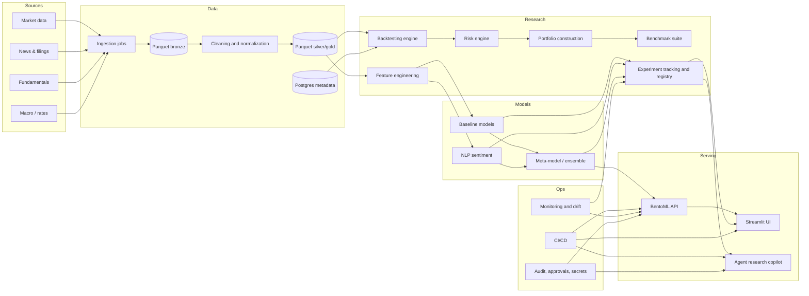

# Prediction Wallet

[](https://www.python.org/)
[](https://github.com/features/actions)
[](LICENSE)
[](https://fastapi.tiangolo.com/)
[](https://ai.pydantic.dev/)

**Prediction Wallet** is an institutional-grade research and autonomous portfolio management platform designed to demonstrate auditable, deterministic, and compliant LLM-driven financial decisions.

Our mission is to bridge the gap between AI-driven innovation and hedge-fund-level rigor through a five-stage governed cycle:

```
OBSERVE → DECIDE → VALIDATE → EXECUTE → AUDIT
(market)   (LLM)  (policy)  (trades)  (trace)
```

---

## 🏛️ Institutional-Grade Architecture

The platform is evolving into a "Research Platform" focused on reproducibility, realistic backtesting, and strict risk management.



---

## 🚀 Key Features & Differentiators

- **Realistic Backtesting**: Event-driven engine with slippage, transaction costs (TCA), and realistic execution models.
- **Scientific Validation**: Walk-forward, purged K-fold, and Combinatorial Purged Cross-Validation (CPCV) to combat backtest overfitting.
- **Institutional Risk Engine**: VaR/CVaR, drawdown control, exposure limits, and factor/risk attribution.
- **MLOps & Reproducibility**: Experiment tracking via **MLflow**, data versioning with **DVC**, and model registry for a clear audit trail.
- **NLP Sentiment**: Integrated **FinBERT** signal processing for market sentiment analysis.
- **Governance First**: AI agents act as research copilots and orchestrators with deterministic guardrails—never as unchecked decision-makers.

---

## 🗺️ Roadmap: The Path to Hedge-Fund Grade

| Phase | Objective | Livrables |
|---|---|---|
| **1. Scientific Foundation** | Solidify the quantitative core | Backtest v2, costs/slippage, position sizing, benchmarks |
| **2. Data & Reproducibility** | Ensure traceable results | Parquet (Bronze/Silver/Gold), DVC, data catalogs |
| **3. Risk & Portfolio** | Institutional metrics | VaR/CVaR, exposure limits, drawdown guard, attribution |
| **4. Experimentation** | Industrialize research | MLflow tracking & registry, model cards, experiment comparison |
| **5. NLP & Multi-Strategy** | Depth of alpha | FinBERT sentiment, news pipelines, ensemble models |
| **6. Ops & Governance** | Demonstrable reliability | CI/CD, drift monitoring, agent copilots with audit logs |

---

## 📂 Architecture Overview

- `agents/`: Pydantic AI orchestrator (Research Copilot) and deterministic policy engine.
- `engine/`: Financial logic (Risk, Performance, Backtest v2, Monte Carlo, Portfolio math).
- `trading_core/`: Order Management System (OMS), Ledger, and Security Master.
- `ml/`: Model training pipelines, FinBERT integration, and experiment logic.
- `data/`: Ingestion scripts and versioned Parquet storage (Bronze/Silver/Gold).
- `services/`: Market data, execution, and reporting gateways.
- `db/`: PostgreSQL metadata and SQLite event sourcing.
- `frontend/`: Vite + React UI for real-time visualization and analytics.

---

## 🛠️ Quickstart

```bash
git clone https://github.com/your-username/prediction-wallet
cd prediction-wallet
python -m venv .venv && source .venv/bin/activate
pip install -e .

# Configure environment (AI_PROVIDER, GEMINI_API_KEY, MLFLOW_TRACKING_URI, etc.)
cp .env.example .env

# Initialize system
python main.py init

# Run a governed rebalancing cycle
python main.py run-cycle --mode simulate

# Launch a research experiment (MLflow tracked)
python main.py research-backtest --strategy ensemble --days 90

# Generate a governance audit report
python main.py governance-report
```

---

## 📑 Documentation

- [Governance Model](docs/GOVERNANCE.md) — Institutional guardrails and MLOps governance.
- [Risk Model](docs/RISK_MODEL.md) — Quantitative risk metrics and stress testing.
- [Trading Core](docs/TRADING_CORE.md) — Realistic execution and OMS logic.
- [Data Pipeline](docs/DATA_PIPELINE.md) — Parquet, DVC, and PostgreSQL architecture.
- [API Reference](docs/api.md) — System endpoints and schemas.
- [Documentation Index](docs/INDEX.md) — Full map of documentation.
