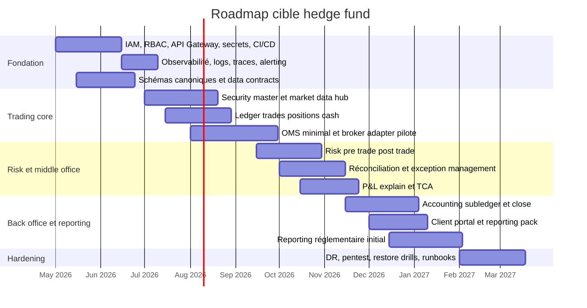
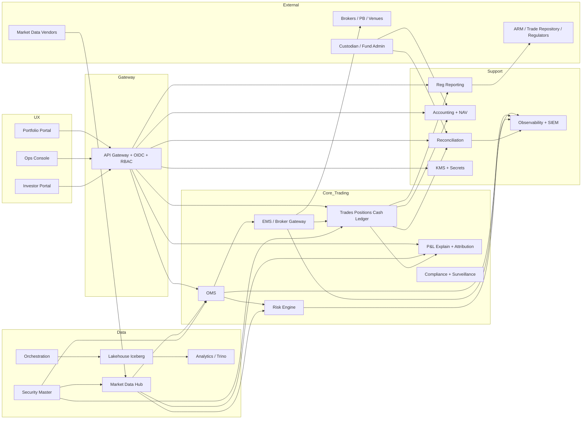

# Plan directeur d’une plateforme hedge fund à partir de RaaaayN/portfolio et RaaaayN/prediction-wallet

## Résumé exécutif

L’analyse des deux dépôts limitée à entity["organization","GitHub","code hosting platform"] et aux seuls repositories demandés conduit à une conclusion nette. **RaaaayN/portfolio** est un très bon socle de **présentation client / vitrine institutionnelle** : application Next.js/React bilingue, profil piloté par fichiers JSON, page de chat avec assistant IA, formulaire de contact, garde-fous anti-spam et anti-prompt-injection, et configuration Gemini avec fallback de modèles. En revanche, ce dépôt ne couvre pas les primitives indispensables d’un hedge fund de production — identité, ordres, exécutions, positions, cash, réconciliation, pricing, risk, conformité, reporting réglementaire, audit comptable — et doit être vu comme une brique **front-end / portal** plutôt que comme un cœur de plateforme d’investissement. fileciteturn15file0L1-L1 fileciteturn24file0L1-L1 fileciteturn36file0L1-L1 fileciteturn23file0L1-L1 fileciteturn22file0L1-L1 fileciteturn45file0L1-L1 fileciteturn46file0L1-L1

**RaaaayN/prediction-wallet** est beaucoup plus proche d’un **noyau de recherche et de paper-trading gouverné**. Le dépôt embarque un backend FastAPI, un cycle explicite **observe → decide → validate → execute → audit**, un moteur de politiques déterministes, un event log immuable, une base SQLite/PostgreSQL, des endpoints pour positions, expositions, idée-book, stress tests, backtests, corrélations, Monte Carlo, P&L attribution, ainsi qu’une suite de tests Pytest. Le projet démontre une très bonne compréhension de la gouvernance d’un moteur d’investissement piloté par IA. Cependant, il reste aujourd’hui **hors périmètre d’un hedge fund de production** : mode live explicitement bloqué, données de marché issues de yfinance, absence d’OMS/EMS institutionnel, pas de connectivité broker/exchange certifiée, pas de lifecycle complet d’ordres, pas de réconciliation externe, pas de ledger comptable/NAV, pas de moteur réglementaire, pas d’authentification/segregation des rôles, et une CORS trop permissive. fileciteturn26file0L1-L1 fileciteturn27file0L1-L1 fileciteturn44file0L1-L1 fileciteturn28file0L1-L1 fileciteturn29file0L1-L1 fileciteturn30file0L1-L1 fileciteturn32file0L1-L1 fileciteturn33file0L1-L1 fileciteturn34file0L1-L1 fileciteturn35file0L1-L1 fileciteturn47file0L1-L1

L’architecture cible recommandée est donc **bimodale**. Le dépôt **portfolio** devient le socle d’un **client portal / investor portal / ops portal**. Le dépôt **prediction-wallet** devient un **lab quant gouverné**, à industrialiser progressivement en briques séparées : **security master**, **market data platform**, **OMS/EMS**, **portfolio & cash ledger**, **risk engine**, **P&L & attribution**, **reconciliation & accounting**, **compliance surveillance**, **regulatory reporting**, **data platform**, **SRE/observability**, puis **client reporting**. Cette cible doit être conçue sous hypothèse **UE / France** : AIFM/AIFMD pour la gestion de FIA, MiFID II/MiFIR pour les services d’investissement et le transaction reporting, EMIR pour les dérivés OTC, DORA pour la résilience opérationnelle numérique, LCB-FT/KYC sous supervision de l’entity["organization","AMF","france markets regulator"] et de l’ACPR, et sécurité / journalisation / chiffrement conformes aux attentes de la entity["organization","CNIL","france data regulator"]. L’extension entity["organization","SEC","us securities regulator"] n’est pertinente qu’en cas d’activité ou d’enregistrement aux États-Unis. citeturn6search0turn6search4turn5search1turn4search1turn4search2turn5search0turn8search0turn9search0turn7search0turn7search4turn7search5turn7search7turn10search2

En pratique, le meilleur plan consiste à **ne pas réécrire from scratch**. Il faut préserver ce que le code fait déjà bien : la gouvernance déterministe, l’event sourcing, le modèle d’idées, les métriques de book, les tests métiers côté prediction-wallet, et l’excellence UX côté portfolio. La feuille de route optimale est une transformation en **plateforme modulaire** sur **12 à 18 mois** pour un scope hedge fund “équities long/short + ETF + crypto spot” sans dérivés complexes, avec une montée graduelle vers les fonctions middle/back office. Les composants les plus rentables à bâtir d’abord sont : **IAM/RBAC**, **ledger canonique trades/positions/cash**, **OMS et state machine d’ordres**, **connectivité broker/FIX**, **market data mastering**, **réconciliation**, **P&L intraday/EOD**, **risk limits**, **audit trail et observabilité**. fileciteturn44file0L1-L1 fileciteturn28file0L1-L1 fileciteturn29file0L1-L1 fileciteturn30file0L1-L1 citeturn11search0turn11search12turn16search1turn16search2

## Cartographie métier cible

Sous l’hypothèse d’une société de gestion ou d’un hedge fund opéré principalement depuis la entity["country","France","europe"] / l’entity["organization","Union européenne","supranational union"], la cartographie ci-dessous vise à couvrir le noyau opérationnel, les obligations réglementaires et les contrôles d’une plateforme buy-side moderne. Si l’activité reste **strictement proprietary trading sans investisseurs externes**, certains blocs — KYC investisseur, client reporting, annexes AIFM détaillées — deviennent partiellement ou totalement **non applicables**. Si la plateforme opère des dérivés OTC, EMIR, collateral et margining deviennent immédiatement centraux ; si elle fournit des services d’investissement à des tiers, MiFID II/MiFIR et les obligations de transaction reporting et de record keeping montent au premier rang. citeturn6search0turn5search1turn4search1turn4search2turn5search0turn8search0turn9search0turn7search7turn10search2

| Fonction métier | Objectifs métier | KPIs clés | Données nécessaires | Composants logiciels typiques | Intégrations requises | Risques et contrôles |
|---|---|---|---|---|---|---|
| Research & idea generation | Produire des thèses investissables traçables | hit-rate, IR, délai idée→trade, % idées invalidées | notes de recherche, fundamentals, macro, news, alternative data | research notebook, idea book, knowledge base, experimentation env | market data, filings, news, warehouse | versioning recherche, revue indépendante, provenance des sources |
| Portfolio construction | Transformer les thèses en book cohérent | active risk, turnover, gross/net, concentration, beta | positions, covariance, factor exposures, constraints | optimizer, scenario engine, constraint engine | risk engine, security master, benchmark data | limites de concentration, contraintes mandat, validation PM/Risk |
| Trading algo | Définir la stratégie d’exécution | fill rate, implementation shortfall, slippage | order book, quotes, vol, ADV, venue stats | algo engine, scheduler, TCA | EMS, venue adapters, market data low latency | garde-fous prix/qty, anti-runaway, throttling |
| OMS | Capturer, router et suivre les ordres | order acceptance latency, reject rate, amend rate | orders, allocations, statuses, brokers, accounts | order state machine, rules engine, blotter | PM tools, EMS, brokers, FIX/REST | ségrégation des rôles, idempotence, audit trail, kill switch |
| EMS & execution | Exécuter au meilleur coût et prouver la best execution | implementation shortfall, slippage, venue quality | quotes, fills, venue book, timestamps | smart order router, broker adapters, TCA | FIX/FIXS, brokers, venues, clocks/NTP/PTP | best execution, clock sync, replay, message integrity |
| Market data | Distribuer une donnée propre, horodatée, licite | freshness, completeness, cost/usage ratio | reference data, prices, corp actions, calendars, curves | market data hub, ticker mapping, cache, entitlement layer | vendors, exchanges, symbology services | licensing, stale data detection, schema validation |
| Positions & cash | Maintenir la vérité opérationnelle du book | position breaks, cash breaks, aged breaks | orders, fills, fees, FX, settlements | trade store, positions engine, cash ledger | OMS, custodian, prime broker, accounting | double comptabilisation, breaks, end-of-day signoff |
| Risk management | Mesurer risque marché, liquidité, concentration, stress | VaR, ES, drawdown, gross/net, beta, liquidity days | returns, vols, curves, factors, positions | risk engine, limits service, stress/scenario | market data, positions, exposures | independent risk, breaches, pre-trade/post-trade checks |
| Performance attribution & P&L explain | Expliquer la performance et les écarts | explained P&L %, unexplained P&L, attribution latency | positions, trades, costs, benchmarks, FX | P&L engine, attribution engine, explain service | positions, market data, accounting | cohérence front/back, explained vs unexplained thresholds |
| Middle office & reconciliation | Fiabiliser exécutions, positions et cash | break rate, time-to-repair, failed settlements | executions internes/externe, confirms, statements | reconciliation engine, exception workflow | PB, brokers, custodians, admin fund | maker-checker, aging, evidence trail |
| Counterparty management | Gérer primes, brokers, limits et légal | counterparty exposure, concentration, fails | LEI, legal terms, commissions, financing | counterparty master, credit limit service | CRM, legal docs, PB/broker portals | concentration, expired docs, sanctions screening |
| Collateral & margin | Couvrir les exigences de marge et collateral | margin utilization, collateral drag, disputes | OTC/cleared positions, CSA terms, valuations | margin engine, collateral optimizer, dispute workflow | CCP, tri-party, PB, custody | margin calls ratées, valuation disputes, wrong-way risk |
| Accounting & NAV | Produire une comptabilité et une NAV propres | NAV timeliness, NAV breaks, accrual accuracy | journals, fees, FX, accruals, corp actions | accounting subledger, NAV engine, close workflow | fund admin, custodian, ERP/GL | T+1 close delays, signoff, adjustment controls |
| Compliance & surveillance | Prévenir non-conformité et abus de marché | alerts closed, false positive rate, overdue reviews | KYC, sanctions, watchlists, communications, trading activity | rules engine, surveillance, case management | KYC providers, sanctions lists, email/chat archive | AML/KYC, MAR abuse, restricted lists, personal account dealing |
| Regulatory reporting | Répondre au superviseur | on-time filing rate, rejection rate | transactions, exposures, leverage, derivatives, client data | reporting mart, schema validators, generation service | ARM/TR, regulator schemas, reference DBs | MiFIR rejects, AIFM data quality, EMIR penalties |
| Client / investor reporting | Donner une vision fiable et lisible aux investisseurs | report timeliness, query turnaround, data consistency | NAV, performance, holdings, fees, ESG if needed | reporting service, investor portal, document engine | CRM, accounting, DMS | incohérences disclosure, leaks de données, stale reports |
| Data platform | Industrialiser stockage, lineage, calcul | data freshness, lineage coverage, cost/query | raw ticks, bars, events, docs, analytics | lakehouse, warehouse, catalog, quality checks | ETL/ELT, orchestration, BI | lineage manquant, quality drift, uncontrolled copies |
| Infra / SRE / SecOps | Assurer disponibilité, résilience et sécurité | uptime, MTTR, MTTD, patch SLA, change failure rate | logs, traces, metrics, infra inventory | IAM, secrets, CI/CD, KMS, SIEM, observability | cloud, IdP, ticketing, on-call | privilege creep, secret leakage, poor backup/restore |

La lecture stratégique est simple : **prediction-wallet couvre déjà embryonnairement** Research, Portfolio Construction, Risk, Event Sourcing, une partie du P&L attribution et une API de consultation ; **portfolio couvre** une partie du Client Portal / UX ; **presque tout le middle office, le back office, la conformité et l’industrialisation manquent encore**. fileciteturn41file0L1-L1 fileciteturn31file0L1-L1 fileciteturn48file0L1-L1 fileciteturn38file0L1-L1 fileciteturn36file0L1-L1

## Analyse technique des dépôts

Le dépôt **RaaaayN/portfolio** est techniquement cohérent et mature pour un site personnel moderne. Le `package.json` montre un stack **Next.js 15 / React 19 / TypeScript / Tailwind / Framer Motion / Google Generative AI / Nodemailer** avec scripts de build classiques. La logique métier est volontairement simple : les contenus sont lus depuis deux fichiers JSON bilingues par `readProfile`, la page `/chat` appelle une route `/api/chat`, et `/api/contact` envoie un email après validation, rate limiting et honeypot. Le module `security.ts` centralise un rate limiter en mémoire, la détection d’injections de prompt, l’échappement HTML et la sanitation de sortie LLM ; `geminiConfig.ts` définit le modèle Gemini principal et des modèles de secours. Cela en fait une excellente base pour un **portail investisseur**, un **portal ops** ou une **console d’explicabilité**, mais pas pour les métiers de trading et d’ops eux-mêmes. fileciteturn15file0L1-L1 fileciteturn24file0L1-L1 fileciteturn36file0L1-L1 fileciteturn23file0L1-L1 fileciteturn22file0L1-L1 fileciteturn45file0L1-L1

Le dépôt **RaaaayN/prediction-wallet** a une ambition beaucoup plus proche d’un hedge fund. Le `pyproject.toml` assemble un runtime **Python 3.13**, **Pydantic AI**, **FastAPI**, **yfinance**, **pandas/numpy/scipy**, **OpenTelemetry** et **pytest**. `api/main.py` expose une API riche qui sert à la fois l’UI et les données de portefeuille, de book risk, de P&L attribution, de backtest et d’event replay. `agents/portfolio_agent.py` orchestre le cycle complet, `agents/policies.py` implémente une validation déterministe hiérarchique, `engine/hedge_fund.py` calcule expositions et P&L attribution, `db/schema.py` définit les tables cœur, `db/events.py` fournit un journal immuable, `services/market_service.py` gère la donnée de marché et son cache, et `services/execution_service.py` maintient le portefeuille simulé. Les tests montrent une vraie discipline logicielle orientée métier. fileciteturn26file0L1-L1 fileciteturn27file0L1-L1 fileciteturn44file0L1-L1 fileciteturn28file0L1-L1 fileciteturn31file0L1-L1 fileciteturn29file0L1-L1 fileciteturn30file0L1-L1 fileciteturn32file0L1-L1 fileciteturn33file0L1-L1 fileciteturn34file0L1-L1 fileciteturn35file0L1-L1

La limite majeure de **prediction-wallet** n’est pas la qualité du raisonnement logiciel, mais son **niveau d’industrialisation**. Le projet est encore centré sur un book compact, des données retail, une logique de simulation, un stockage léger et une gouvernance interne. Le live est bloqué par policy, l’API n’a pas d’authn/authz visible, la CORS est ouverte à `*`, le setup PostgreSQL reste local via Docker Compose, et la donnée de marché dépend de yfinance plutôt que d’un vendor institutionnel horodaté/contractualisé. Ces choix sont excellents pour une démonstration gouvernée et pour un laboratoire quant, mais insuffisants pour l’exploitation réelle d’un hedge fund soumis à exigences de robustesse, de séparation des tâches, de résilience et de preuves réglementaires. fileciteturn28file0L1-L1 fileciteturn27file0L1-L1 fileciteturn32file0L1-L1 fileciteturn42file0L1-L1 fileciteturn43file0L1-L1 citeturn8search0turn4search2turn7search7

| Dépôt | Fichier / module clé | Rôle observé | Maturité | Gap principal | Recommandation concrète |
|---|---|---|---|---|---|
| portfolio | `package.json` | socle web Next.js/React moderne | Bonne | aucun outillage métier finance | reconvertir en investor/ops portal | 
| portfolio | `lib/readProfile.ts` | modèle de contenu piloté par JSON bilingue | Bonne | pas de données dynamiques ni ACL | remplacer par API BFF + CMS léger / DB | 
| portfolio | `app/chat/page.tsx` | UI conversationnelle RAG | Bonne | pas de source-of-truth métier ni auth | brancher sur API hedge-fund sécurisée et journalisée |
| portfolio | `app/api/contact/route.ts` | workflow de contact par email | Moyenne | pas de case management / CRM / tickets | remplacer par file d’attente + CRM + audit |
| portfolio | `lib/security.ts` | rate limit mémoire, sanitation, prompt defense | Bonne | non distribué, non persistant | porter vers Redis + WAF + SIEM |
| prediction-wallet | `agents/portfolio_agent.py` | cœur d’orchestration observe/decide/validate/execute/audit | Très bonne | pas de séparation service/domain/event bus | extraire en microservices/domain services |
| prediction-wallet | `agents/policies.py` | policy-as-code déterministe | Très bonne | périmètre limité aux ordres simulés | étendre au pre-trade, post-trade, compliance, venue rules |
| prediction-wallet | `db/schema.py` + `db/events.py` | ledger minimal + event sourcing | Bonne | pas de versioning comptable, pas de settlement/NAV | introduire ordres, fills, allocations, cash, journals |
| prediction-wallet | `services/market_service.py` | cache et normalisation OHLCV | Bonne pour prototype | feed retail non contractuel | brancher vendor institutionnel + entitlement + QA |
| prediction-wallet | `services/execution_service.py` | simulation d’exécution et portefeuille | Bonne pour paper trading | pas d’OMS/EMS, pas d’order lifecycle externe | créer OMS/EMS et connectivité FIX/REST |
| prediction-wallet | `tests/test_policies.py` + `tests/test_hedge_fund.py` | tests métiers pertinents | Bonne | couverture non visible sur middle/back office | élargir aux réconciliations, P&L explain, auth, DR |
| prediction-wallet | `api/main.py` | API d’agrégation + UI static serving | Moyenne | CORS ouverte, pas d’auth, surface large | placer API Gateway, OIDC, RBAC, scopes, rate limits |

Sources du tableau : fileciteturn15file0L1-L1 fileciteturn24file0L1-L1 fileciteturn36file0L1-L1 fileciteturn23file0L1-L1 fileciteturn22file0L1-L1 fileciteturn44file0L1-L1 fileciteturn28file0L1-L1 fileciteturn29file0L1-L1 fileciteturn30file0L1-L1 fileciteturn32file0L1-L1 fileciteturn33file0L1-L1 fileciteturn34file0L1-L1 fileciteturn35file0L1-L1

## Composants manquants et spécifications cibles

Le delta entre l’existant et une plateforme hedge fund de production se concentre dans les domaines suivants : **identité et contrôle d’accès**, **ledger canonique**, **OMS/EMS**, **réconciliations**, **données de marché institutionnelles**, **reporting réglementaire**, **accounting/NAV**, **surveillance conformité**, **observabilité et résilience**. Cette conclusion découle directement des fichiers inspectés dans les deux dépôts et des attentes minimales associées à MiFID II/MiFIR, AIFM/AIFMD, EMIR, DORA, LCB-FT et journalisation/sécurité. fileciteturn27file0L1-L1 fileciteturn29file0L1-L1 fileciteturn30file0L1-L1 fileciteturn32file0L1-L1 citeturn4search1turn4search2turn6search0turn5search0turn8search0turn9search0turn7search7

| Composant cible | Fonction couverte | API minimale | Schéma cœur | Latence / volume / SLA proposés | Sécurité / conformité | Priorité valeur/effort |
|---|---|---|---|---|---|---|
| IAM / RBAC / SSO | accès, séparation des tâches | OIDC/OAuth2, `/auth/me`, `/roles/*` | users, roles, permissions, service_accounts | auth <300 ms, SLA 99.9% | MFA, least privilege, break-glass, audit | Très haute / Faible |
| Security master | univers titres/codes | `/securities`, `/mappings`, `/corporate-actions` | securities, listings, identifiers, corp_actions | T+0 refdata, SLA 99.9% | source precedence, dual control | Très haute / Moyenne |
| Market data hub | pricing, bars, snapshots | `/prices/latest`, `/bars`, `/quotes`, `/curves` | price_bars, quotes, vendors, entitlements | EOD <5 min, intraday 1–5 s, SLA 99.9% | entitlement, stale checks, lineage | Très haute / Moyenne |
| OMS | création/suivi d’ordres | `/orders`, `/orders/{id}`, `/allocations` | orders, order_events, allocations | ack interne <100 ms, SLA 99.95% | maker-checker, idempotency, clock sync | Très haute / Haute |
| EMS / broker gateway | exécution & routing | FIX/REST adapters, `/venues`, `/executions` | broker_sessions, executions, rejects | venue ack <50–500 ms selon canal | FIXS/TLS, replay, session controls | Très haute / Haute |
| Positions & cash ledger | source-of-truth opérationnelle | `/positions`, `/cash-ledger`, `/snapshots` | trades, positions_lots, cash_movements | intraday refresh 1–5 s, EOD cutoffs | immutable events, reconciliation hooks | Très haute / Moyenne |
| P&L / attribution / explain | performance & écarts | `/pnl/daily`, `/pnl/explain`, `/attribution` | pnl_daily, pnl_explain, factor_attribution | intraday 1–5 min, EOD before T+1 7h | explained/unexplained thresholds | Haute / Haute |
| Risk engine | limites, stress, liquidité | `/risk/pretrade`, `/risk/book`, `/limits` | limits, exposures, scenarios, var_runs | pre-trade <20 ms, post-trade <1 s | independent model validation | Très haute / Haute |
| Reconciliation engine | middle office | `/recon/runs`, `/recon/breaks`, `/exceptions` | recon_runs, breaks, statements | T+0/T+1 batches, SLA 99.9% | maker-checker, evidence capture | Très haute / Moyenne |
| Compliance surveillance | KYC/AML/MAR | `/alerts`, `/cases`, `/screening` | kyc_profiles, screenings, alerts, cases | screening sync <1 s; batch nightly | sanctions, BO, restricted lists | Haute / Haute |
| Regulatory reporting | AIFM, MiFIR, EMIR | `/reports/aifm`, `/reports/mifir`, `/reports/emir` | submissions, report_snapshots, rejects | statutory deadlines, SLA 99.9% | schema validation, signoff, retention | Haute / Haute |
| Accounting / NAV | back office | `/journals`, `/nav`, `/close` | journals, accruals, nav_runs, fees | EOD/T+1 close | dual signoff, immutable adjustments | Haute / Haute |
| Client / investor portal | reporting externe | BFF `/portal/*` | investor_accounts, documents, entitlements | UI p95 <1 s, SLA 99.9% | row-level security, watermarking | Moyenne / Moyenne |
| Data lakehouse | analytics & lineage | SQL/ELT + ingestion APIs | Iceberg tables, catalogs, lineage | scalable batch + ad hoc | retention, masking, classification | Haute / Moyenne |
| Orchestration & observability | ops & SRE | DAG/API scheduling, telemetry export | run_metadata, traces, metrics, alerts | SLO-driven | logs/traces/metrics corrélés | Très haute / Faible |

### Matrice valeur / effort

| Quadrant | Composants |
|---|---|
| Gains rapides | IAM/RBAC, API Gateway, secrets/KMS, CI/CD, observabilité OTel, quality checks, investor portal BFF |
| Paris structurants | security master, market data hub, positions/cash ledger, reconciliation engine |
| Paris critiques | OMS, EMS/broker gateway, risk pre-trade, P&L explain |
| Extension réglementaire | AIFM/MiFIR/EMIR reporting, accounting/NAV, collateral/margin, surveillance avancée |

Les cibles de latence, volumes et SLA ci-dessus sont des **cibles d’architecture proposées**, non des obligations réglementaires en tant que telles. Elles sont dimensionnées pour une plateforme buy-side moyenne, multi-utilisateurs, avec book restreint au départ et croissance vers plusieurs stratégies. En l’absence d’hypothèse de budget, d’équipe et d’univers exact d’actifs, elles doivent être lues comme **baseline de design**. citeturn8search0turn11search12turn16search1turn16search2

### Exemples de spécifications d’API

Les exemples suivants traduisent les observables des dépôts en contrats API industrialisables. Ils s’alignent sur les exigences de traçabilité d’ordres, de record keeping, de sécurité des sessions FIX et de gouvernance des décisions. fileciteturn27file0L1-L1 fileciteturn29file0L1-L1 fileciteturn30file0L1-L1 fileciteturn47file0L1-L1 citeturn4search1turn4search2turn11search0turn11search12

```yaml
POST /api/v1/orders
Request:
  portfolio_id: hf-eq-ls-main
  strategy_id: core-longs
  instrument_id: US0378331005
  side: BUY
  order_type: LIMIT
  quantity: 2500
  limit_price: 187.25
  tif: DAY
  broker_id: gs_dma
  venue_preferences: [XNYS, XNAS, BATS]
  decision_id: dec_20260418_001
  risk_context:
    gross_after: 1.42
    net_after: 0.56
    sector_after: { tech: 0.29 }
Response:
  order_id: ord_01J...
  status: PENDING_RISK
  accepted_at: 2026-04-18T09:32:14.231Z
```

```yaml
GET /api/v1/positions?portfolio_id=hf-eq-ls-main&as_of=2026-04-18T16:30:00Z
Response:
  snapshot_id: pos_20260418_163000
  positions:
    - instrument_id: US0378331005
      ticker: AAPL
      qty: 2500
      side: LONG
      avg_cost: 181.42
      last_price: 187.90
      market_value: 469750
      weight: 0.0831
      beta: 1.08
      sector: tech
```

```yaml
GET /api/v1/pnl/explain?portfolio_id=hf-eq-ls-main&date=2026-04-18
Response:
  gross_pnl: 124532.87
  explained_pct: 0.962
  components:
    price_move: 101201.10
    fx: -2210.44
    carry: 3188.03
    fees_commissions: -778.40
    financing: -5943.10
    slippage: -8125.62
    corporate_actions: 0.00
    residual: 7201.30
```

### Exemples de schémas de base de données

```sql
CREATE TABLE orders (
  order_id            TEXT PRIMARY KEY,
  portfolio_id        TEXT NOT NULL,
  strategy_id         TEXT NOT NULL,
  instrument_id       TEXT NOT NULL,
  decision_id         TEXT,
  side                TEXT NOT NULL,
  order_type          TEXT NOT NULL,
  tif                 TEXT NOT NULL,
  quantity            NUMERIC(20,8) NOT NULL,
  limit_price         NUMERIC(20,8),
  status              TEXT NOT NULL,
  broker_id           TEXT,
  created_at          TIMESTAMPTZ NOT NULL,
  updated_at          TIMESTAMPTZ NOT NULL,
  created_by          TEXT NOT NULL
);

CREATE TABLE order_events (
  event_id            BIGSERIAL PRIMARY KEY,
  order_id            TEXT NOT NULL REFERENCES orders(order_id),
  event_type          TEXT NOT NULL,
  payload_json        JSONB NOT NULL,
  source_system       TEXT NOT NULL,
  event_ts            TIMESTAMPTZ NOT NULL
);

CREATE TABLE trades (
  trade_id            TEXT PRIMARY KEY,
  order_id            TEXT NOT NULL REFERENCES orders(order_id),
  instrument_id       TEXT NOT NULL,
  side                TEXT NOT NULL,
  fill_qty            NUMERIC(20,8) NOT NULL,
  fill_price          NUMERIC(20,8) NOT NULL,
  venue               TEXT,
  commission          NUMERIC(20,8) DEFAULT 0,
  exec_ts             TIMESTAMPTZ NOT NULL
);

CREATE TABLE positions_lots (
  lot_id              TEXT PRIMARY KEY,
  portfolio_id        TEXT NOT NULL,
  instrument_id       TEXT NOT NULL,
  side                TEXT NOT NULL,
  open_qty            NUMERIC(20,8) NOT NULL,
  avg_cost            NUMERIC(20,8) NOT NULL,
  opened_at           TIMESTAMPTZ NOT NULL,
  strategy_id         TEXT
);

CREATE TABLE price_bars (
  instrument_id       TEXT NOT NULL,
  vendor              TEXT NOT NULL,
  ts                  TIMESTAMPTZ NOT NULL,
  open                NUMERIC(20,8),
  high                NUMERIC(20,8),
  low                 NUMERIC(20,8),
  close               NUMERIC(20,8),
  volume              NUMERIC(20,8),
  PRIMARY KEY (instrument_id, vendor, ts)
);

CREATE TABLE pnl_daily (
  portfolio_id        TEXT NOT NULL,
  pnl_date            DATE NOT NULL,
  gross_pnl           NUMERIC(20,8) NOT NULL,
  net_pnl             NUMERIC(20,8) NOT NULL,
  explained_pct       NUMERIC(10,6),
  residual_pnl        NUMERIC(20,8),
  PRIMARY KEY (portfolio_id, pnl_date)
);
```

## Plan d’implémentation et roadmap

La roadmap proposée préserve les deux dépôts, mais les repositionne clairement : **portfolio = façade UX**, **prediction-wallet = noyau quant gouverné**, puis extraction progressive vers une architecture plus proche d’une plateforme d’investissement institutionnelle. Les estimations en jours/homme sont données **sans hypothèse d’effectif** ; elles visent un périmètre initial “equities/ETF/crypto spot”, sans dérivés complexes et sans comptabilité fonds externalisée. Les exigences DORA, MiFID II record-keeping, AIFM reporting et journalisation CNIL justifient que la sécurité, l’auditabilité et l’observabilité soient traitées dès le premier lot. citeturn8search0turn4search2turn6search0turn7search7

| Phase | Périmètre | Livrables | Estimation |
|---|---|---|---|
| Fondation | IAM, API Gateway, secrets, CI/CD, observabilité, schémas canoniques, refonte config/env | SSO/OIDC, RBAC, KMS, logs/traces/métriques, contrats OpenAPI, registry de schémas | 80–120 j.h. |
| Trading core | security master, market data hub, ledger trades/positions/cash, OMS minimal, broker adapter pilote | master titres, service prix, tables canoniques, state machine ordres, paper/live shadow mode | 120–180 j.h. |
| Risk & middle office | risk pre/post trade, reconciliations, breaks, TCA, P&L explain, exposure dashboards | limit service, recon engine, exception console, pnl explain EOD, stress/scenario industrialisés | 140–220 j.h. |
| Back office & reporting | accounting subledger, NAV, client portal BFF, report factory, AIFM/MiFIR/EMIR pack initial | journals, close workflow, investor documents, regulatory marts, evidence packs | 140–220 j.h. |
| Hardening production | DR/BCP, performance, chaos/restore, security tests, runbooks, audit | PRA/PCA, restore drills, pentest, tabletop exercises, support model | 80–140 j.h. |

### État d'avancement observé au 2026-04-18

Le plan ci-dessus reste la cible d'architecture. L'état réel du dépôt `prediction-wallet` est plus avancé sur la gouvernance que sur l'industrialisation métier. Pour s'y retrouver, le bon repère est le suivant :

| Phase | Statut observé | Ce qui est déjà en place | Ce qui reste à construire |
|---|---|---|---|
| Fondation | **Terminée (Avril 2026)** | IAM (API Keys), RBAC (Admin/Trader/Viewer), Middleware de logging structuré, Tracing OTel FastAPI, Contrats d'API explicites (Pydantic models), Documentation sécurité | Intégration OIDC complète (Azure/Okta), Registry de schémas avancé |
| Trading core | Prototype fonctionnel en simulation | market service, execution service, ordres simulés, calculs de portefeuille, slippage, règles de drift, journal d'événements | security master, market data hub contractuel, ledger canonique, OMS/EMS, broker adapter, shadow/live mode |
| Risk & middle office | Partiellement couvert | VaR/CVaR, stress tests, corrélation, kill switch, explainability, traces d'audit | réconciliation, breaks, TCA industrialisé, dashboards d'exposition, workflow d'exception |
| Back office & reporting | Non amorcé | reporting PDF et vues API de base | accounting/NAV, client portal BFF, packs réglementaires, evidence packs |
| Hardening production | Non amorcé | tests automatisés, logs structurés, base d'observabilité | PRA/PCA, restauration, pentest, runbooks, support model |

Lecture rapide : la fondation logique est déjà là, le trading core reste un socle de recherche/paper trading gouverné, et le passage vers une plateforme institutionnelle demande encore les couches d'identité, d'intégration marché et de back office.

### Timeline Gantt



### Architecture cible



### Risques de mise en œuvre et mitigations

| Risque | Impact | Mitigation |
|---|---|---|
| Sur-architecture trop tôt | retard, coût | livrer un OMS minimal avant les fonctionnalités “intelligentes” |
| Dépendance excessive aux LLM | risque opérationnel | garder les décisions LLM non exécutoires sans policy engine |
| Dette de données de marché | faux signaux, mauvais P&L | vendor institutionnel + QA + lineage + fallback |
| Mauvaise séparation FO/MO/BO | erreurs et conflits d’intérêt | RBAC fort, workflows maker-checker, ownership clair |
| Scope réglementaire mal cadré | surcoût ou non-conformité | cartographie juridique initiale UE/France + matrice d’applicabilité |
| Mauvais PRA/PCA | indisponibilité prolongée | backups chiffrés, restore tests, runbooks, tabletop exercises |

## Recommandations stack et checklist sécurité conformité

Le stack recommandé doit être **cloud-native, modulaire, observable et testable**, tout en restant réaliste par rapport à l’existant. Le choix le plus naturel est de **prolonger FastAPI/Pydantic/PostgreSQL** sur le plan transactionnel, d’ajouter une **observabilité standardisée via OpenTelemetry**, une **orchestration batch/workflows** via Airflow ou Prefect, et un **lakehouse analytique** via Iceberg + moteur SQL distribué de type Trino. Ce choix a l’avantage d’être cohérent avec `prediction-wallet`, qui utilise déjà FastAPI, Pydantic Settings et OpenTelemetry-ready dependencies, tout en ouvrant une trajectoire robuste vers l’échelle. fileciteturn26file0L1-L1 citeturn18search0turn18search2turn17search0turn16search2turn16search1turn20search8turn20search3turn19search4turn19search5

Pour la connectivité de marché et d’exécution, la bonne norme reste **FIX** et sa déclinaison sécurisée **FIXS/TLS**. FIX Trading Community rappelle que FIX est un standard ouvert et non propriétaire couvrant largement le cycle de trading, dont la sécurisation par FIX-over-TLS est explicitement standardisée. Pour un premier incrément, un **adapter layer** doit pouvoir parler FIX lorsqu’un broker/EMS l’exige et REST/WebSocket lorsqu’un partenaire ne supporte pas FIX. Côté implémentation, des moteurs open-source de la famille QuickFIX sont adaptés ; côté buy-side “enterprise”, il faut prévoir des options d’intégration avec des OMS/EMS déjà établis si le time-to-market prime sur la construction interne. citeturn11search0turn11search2turn11search12

Pour les modèles quant, la recommandation n’est pas de partir directement sur le ML “opaque”. Le meilleur chemin est : **Markowitz / contraintes / risk budgeting** pour l’allocation de base, **Black-Litterman** pour intégrer des vues discrétionnaires ou quantitatives, **Brinson** pour l’attribution de performance, puis **Almgren-Chriss** et ses extensions pour l’exécution. Le ML doit arriver en second rideau, pour le ranking d’idées, le nowcasting de liquidité, l’anomaly detection et, éventuellement, des politiques RL sur des bacs à sable fortement bornés — jamais comme substitut au contrôle déterministe de l’exécution. citeturn14search4turn14search2turn14search1turn13search0turn15search0turn15search4

### Checklist sécurité et conformité pour la production

Cette checklist est priorisée pour un lancement progressif sous hypothèse UE/France. Elle suit les attentes de DORA, des lignes AMF sur la vigilance clientèle, et des recommandations CNIL sur sécurité, chiffrement et journalisation. citeturn8search0turn9search0turn7search4turn7search5turn7search7turn7search8

- **Identité et accès** : SSO OIDC, MFA obligatoire, RBAC strict, comptes de service dédiés, rotations automatiques, revues trimestrielles des droits.
- **Secrets et clés** : aucun secret dans le code, KMS/Vault, rotation, séparation dev/stage/prod, procédures de révocation.
- **Chiffrement** : TLS partout, chiffrement at-rest, hachage robuste des mots de passe, signatures pour documents sensibles.
- **Journalisation** : logs d’accès, création, modification, suppression, événements d’ordres, décisions de policy, actions admin ; conservation maîtrisée et protégée.
- **Audit trails** : event sourcing immuable pour ordres/trades/breaks/rapports ; lien explicite entre décision, ordre, exécution et reporting.
- **Sécurité applicative** : SAST, DAST, dependency scanning, secret scanning, validation d’inputs, protections anti-CSRF/XSS/SSRF, rate limiting distribué.
- **Tests** : unitaires, intégration, end-to-end, property-based sur ledger, tests de restauration, tests de non-régression réglementaire, tests de charge OMS.
- **Données** : catalogue, classification, masking PII, lineage, quality checks, rétention et purge.
- **Résilience** : backups chiffrés, PRA/PCA, restore drill périodique, tests de bascule, runbooks, astreinte.
- **Conformité** : matrice d’applicabilité AIFM/MiFID/EMIR/SEC, calendrier déclaratif, evidence packs, signoff FO/MO/Compliance/Finance.
- **LCB-FT / KYC** : identification, vérification, bénéficiaire effectif, screening sanctions/PEP, approche par les risques, workflow d’escalade.
- **Horodatage et record keeping** : synchronisation d’horloge, granularité cohérente, preuve de séquence des événements, conservation conforme.

## Annexes

### Références prioritaires consultées

Les sources externes les plus structurantes ont été : la documentation de l’entity["organization","ESMA","eu markets regulator"] sur le transaction reporting et l’order record keeping MiFID II/MiFIR, la Commission européenne et l’AMF sur AIFMD/AIFM 2, la Commission européenne sur EMIR, le règlement DORA au Journal officiel de l’UE, la doctrine AMF sur la vigilance KYC/BO, le GAFI sur les bénéficiaires effectifs, la CNIL sur sécurité/chiffrement/journalisation, FIX Trading Community sur FIX/FIXS, les docs officielles FastAPI/PostgreSQL/OpenTelemetry/Airflow/Prefect/Iceberg/Trino/Great Expectations, et les références académiques ou quasi-primaires autour de Markowitz, Black-Litterman, Brinson et Almgren-Chriss. citeturn4search1turn4search2turn5search0turn5search1turn6search0turn6search4turn8search0turn9search0turn7search0turn7search4turn7search5turn7search7turn11search0turn11search12turn18search0turn16search2turn16search1turn20search8turn20search3turn19search4turn19search5turn20search5turn14search4turn14search1turn13search0turn15search0

### Extraits de code pertinents avec chemin

- `portfolio/lib/security.ts` — rate limiting simple en mémoire et détection de patterns de prompt injection ; bon point de départ, insuffisant pour une prod distribuée. fileciteturn22file0L1-L1
- `portfolio/app/api/contact/route.ts` — honeypot, validation email et envoi Nodemailer ; pattern réutilisable pour un workflow ticketing/CRM mais à externaliser. fileciteturn23file0L1-L1
- `portfolio/lib/readProfile.ts` — contenu piloté par fichiers JSON ; excellent pour un investor portal, pas pour une source transactionnelle. fileciteturn24file0L1-L1
- `prediction-wallet/api/main.py` — surface API large, dont `/api/portfolio`, `/api/positions`, `/api/exposures`, `/api/pnl-attribution`, `/api/events/replay/{cycle_id}` ; bon BFF interne, mais devrait être découpé et sécurisé. fileciteturn27file0L1-L1
- `prediction-wallet/agents/policies.py` — verrou de gouvernance déterministe ; c’est la brique la plus “institutionnalisable” du dépôt. fileciteturn28file0L1-L1
- `prediction-wallet/db/events.py` — journal immuable événementiel ; très bon socle d’audit trail. fileciteturn30file0L1-L1
- `prediction-wallet/services/market_service.py` — cache local + yfinance + indicateurs techniques ; acceptable pour proto, non acceptable comme source réglementaire de pricing. fileciteturn32file0L1-L1
- `prediction-wallet/services/execution_service.py` — exécution simulée et maintenance du portefeuille ; doit évoluer vers OMS/EMS/ledger séparés. fileciteturn33file0L1-L1

### Exemples de tests à écrire en priorité

**Pour portfolio**
- test e2e `chat -> /api/chat -> réponse -> smart buttons` avec auth future ;
- test de non-régression sur prompt injection et secret redaction ;
- test de rate limiting distribué si migration Redis ;
- test snapshot du investor portal avec données mockées ;
- test d’autorisation front par rôles.

**Pour prediction-wallet**
- tests property-based sur le ledger `orders -> fills -> positions -> cash` ;
- tests d’idempotence API sur création d’ordre et ingestion d’exécutions ;
- tests de réconciliation broker/custodian avec breaks simulés ;
- tests de P&L explain avec explained/unexplained thresholds ;
- tests de limites pre-trade et post-trade multi-book ;
- tests DR/restore de PostgreSQL + replay d’event log ;
- tests d’horodatage / record keeping conformes MiFID II ;
- tests d’autorisations RBAC par persona : PM, trader, risk, compliance, ops, admin.
