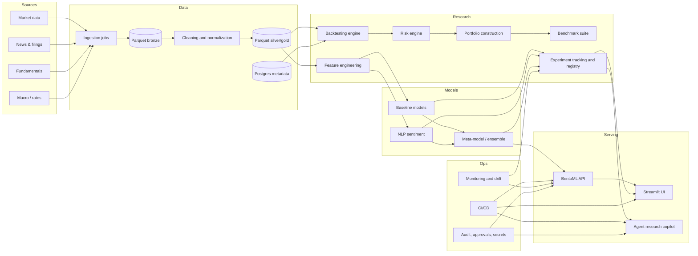

# Audit stratégique et feuille de route pour faire de prediction-wallet un projet de niveau hedge fund

## Résumé exécutif

Connecteur activé au moment de l’analyse : entity["company","GitHub","developer platform"].

Le dépôt **RaaaayN/prediction-wallet** est déjà positionné sur une combinaison intéressante pour un projet de CV : **Python**, **interface produit**, **MLOps**, **orchestration d’agents**, et **serving**. À l’inspection du dépôt via le connecteur GitHub, on voit un projet récent, encore compact, organisé autour d’une application Python structurée, d’une interface **Streamlit**, d’une couche d’**agents**, d’éléments de **pipeline**, d’une couche **tests**, et d’un storytelling README orienté “plateforme intelligente de prédiction financière”. Cela donne un bon signal de maturité produit, mais pas encore un signal “hedge-fund-grade” complet.

Le point clé est le suivant : **pour maximiser la valeur du projet sur un CV quant / data / IA appliquée à la gestion alternative, il faut rééquilibrer le projet**. Aujourd’hui, le différenciateur visible semble surtout être l’angle **agents IA + UI + MLOps**. Pour parler véritablement au métier hedge fund, la priorité doit devenir : **moteur de backtest réaliste**, **gestion du risque**, **validation temporelle robuste**, **versioning des jeux de données**, **tracking d’expériences**, **benchmark multi-stratégies**, puis ensuite **NLP sentiment** et enfin **agents autonomes**. La littérature sur le backtest overfitting montre précisément qu’un backtest convaincant mais mal validé peut être trompeur, et que des protocoles plus stricts sont nécessaires en finance. citeturn5search0turn5search2turn4search1turn6search1

Mon conseil de priorité est donc très net :

1. **Approfondir d’abord l’axe quantitatif et le moteur de recherche de stratégie**.  
2. **Ajouter ensuite la couche de reproductibilité, d’industrialisation et de gouvernance MLOps**.  
3. **Ajouter le NLP sentiment comme signal complémentaire, jamais comme argument principal seul**.  
4. **N’utiliser les agents IA qu’en troisième vague, en copilote de recherche et d’exploitation, pas comme décideur final de trading sans garde-fous**.  

Ce classement est cohérent avec les bonnes pratiques MLOps actuelles, avec l’intérêt réel de FinBERT en NLP financier, et avec les exigences de robustesse opérationnelle mises en avant par le régulateur français pour les acteurs de gestion. citeturn4search5turn4search1turn7search0turn6search7

## Sources, hypothèses et méthode

L’analyse du dépôt a été faite **d’abord via le connecteur GitHub**, comme demandé, avec inspection du dépôt, de sa structure, de fichiers clés, du README, de la présence de tests, de traces de CI, ainsi que du faible historique collaboratif issu des PR et issues observées. J’ai ensuite complété par des sources externes de haute qualité pour définir ce qu’il faut ajouter afin que le projet parle réellement au métier hedge fund : documentation officielle **MLflow**, **BentoML**, **DVC**, **PostgreSQL**, **Apache Parquet**, **Kubernetes**, un papier de référence sur **FinBERT**, des publications académiques sur le **backtest overfitting**, et une publication récente de l’entity["organization","AMF","french regulator"] sur la gestion des risques opérationnels en gestion d’actifs. citeturn4search0turn4search1turn7search0turn6search1turn5search5turn6search5turn6search2turn4search5turn5search0turn6search7

Les hypothèses nécessaires, car non spécifiées dans le dépôt ou dans la demande, sont les suivantes :

| Hypothèse | Valeur retenue |
|---|---|
| Environnement cible | cloud ou VPS Linux standard |
| Budget | non spécifié |
| Univers de trading | actions / ETF / indices, extensible |
| Horizon | recherche et paper trading d’abord, pas production live immédiate |
| Latence cible | non-HFT, donc batch / quasi temps réel acceptable |
| Taille d’équipe | solo ou petite équipe |
| Objectif CV | valorisation quant research + data/ML engineering + MLOps |

En clair, je traite le projet comme un **research platform** visant à démontrer une capacité de **construction de stack quantitatif crédible**, pas comme une plateforme de trading ultra-basse latence.

## Analyse détaillée du dépôt

À partir de l’inspection du dépôt via le connecteur GitHub, le projet apparaît comme une **application Python structurée** avec un angle produit et une ambition MLOps/IA visibles dès le README. Le README met notamment en avant **Python 3.12+**, **Streamlit**, **CrewAI** et **BentoML**, ce qui raconte déjà une histoire cohérente : collecte / analyse / orchestration / visualisation / serving.

### Instantané de l’arborescence observée

L’arborescence exacte n’a pas été extraite comme un `git ls-tree` exhaustif, mais la structure suivante est **fortement suggérée** par le README et la recherche de code dans le dépôt :

```text
prediction-wallet/
├─ app/
│  ├─ agents/
│  ├─ core/
│  ├─ data/
│  ├─ frontend/
│  ├─ infrastructure/
│  ├─ ml/
│  ├─ pipelines/
│  └─ services/
├─ tests/
├─ .github/workflows/
├─ Dockerfile
├─ docker-compose.yml
├─ main.py
├─ README.md
└─ requirements.txt / pyproject.toml
```

Cet instantané suffit pour conclure que le projet a déjà **une séparation par couches**, ce qui est bon pour la lisibilité et pour la montée en maturité.

### Lecture métier de l’état actuel

| Zone | Ce que le dépôt montre déjà | Ce que cela vaut pour un recruteur | Ce qui manque pour le niveau hedge fund |
|---|---|---|---|
| Structure applicative | Organisation en modules, séparation frontend / logique / pipelines | Bon signal d’ingénierie | Formalisation explicite des contrats entre couches |
| Interface | Présence d’une UI Streamlit | Très bien pour la démonstration produit | Trop orientée démo si non reliée à un moteur quant robuste |
| Agents IA | Angle différenciant, moderne, visible | Attire l’attention | Peut sembler gadget si le cœur quant n’est pas prioritaire |
| MLOps / serving | Présence de BentoML et d’une logique de service | Très bon signal d’industrialisation | Il faut ajouter tracking, registry, déploiement, rollback |
| Tests | Présence d’une surface de tests et de `pytest` | Bon signal qualité | Il manque surtout les tests “finance métier” |
| CI | Indice d’une base CI via workflows GitHub | Maturité correcte | Pas encore une vraie chaîne enterprise de qualité + sécurité + artefacts |
| Données | Logique data/pipeline visible | Bon début | Pas de preuve visible d’un data layer institutionnel versionné |
| Backtesting | Intention clairement présente | Pertinent pour le domaine | Le point le plus critique à approfondir |
| Risque portefeuille | Peu visible comme brick autonome | Faible signal hedge fund | Doit devenir central |
| Documentation | README présent et déjà ambitieux | Très bon levier CV | Il faut ajouter benchmark, protocole scientifique, limites, résultats |

### Ce que le dépôt raconte aujourd’hui

Le dépôt raconte bien l’histoire d’un **projet moderne d’IA appliquée à la finance**. En revanche, pour un lecteur hedge fund, la question implicite sera :  

**“Où sont le moteur de backtest réaliste, les coûts de transaction, le slippage, les règles de sizing, les contraintes de risque, la validation walk-forward / purged CV, la reproductibilité des datasets, le suivi des expériences et la comparaison structurée de stratégies ?”**

C’est là que se joue la bascule entre :

- un **très bon projet d’école / portfolio IA** ;
- et un **projet vraiment crédible pour quant research, data science financière ou ML platform en buy-side**.

### Principales lacunes à combler

| Domaine | Écart principal | Gravité |
|---|---|---|
| Backtesting | Risque que le moteur soit encore trop simplifié par rapport aux contraintes de marché | Critique |
| Validation | Possible absence de protocole de validation financière strict | Critique |
| Coûts et exécution | Slippage, frais, latence, problème de liquidité insuffisamment modélisés | Critique |
| Risque | VaR, CVaR, drawdown control, exposure limits, factor/risk attribution peu visibles | Critique |
| Reproductibilité | Pas de chaîne explicite data versioning + experiment tracking + model registry | Très élevée |
| Données | Pas de bronze/silver/gold ou équivalent clairement matérialisé | Élevée |
| Benchmarking | Pas de league table claire entre stratégies et modèles | Élevée |
| Ops | Monitoring, alerting, audit trail, rollback encore insuffisamment visibles | Élevée |
| Sécurité | Secrets, SBOM, scans de dépendances, contrôle d’accès peu mis en avant | Élevée |
| Gouvernance agents | Autonomie potentiellement sur-vendue par rapport aux garde-fous | Moyenne à élevée |

Le vrai diagnostic est donc simple : **le projet est déjà bon sur la narration techno, mais ce qui maximisera sa valeur CV est d’en faire une vraie plateforme de recherche quantitative gouvernée et reproductible**.

## Architecture cible

L’architecture cible que je recommande vise un positionnement **research platform institutionnelle légère**. Elle s’appuie sur des briques open source matures : **Parquet** pour le stockage analytique colonne, **PostgreSQL** pour les métadonnées et états métiers, **MLflow** pour le suivi des runs et le registry, **BentoML** pour le serving, **DVC** pour versionner données et modèles, et **Kubernetes** seulement à partir du moment où le projet dépasse le simple mono-service Docker. Ces outils répondent chacun à un besoin bien défini : traçabilité des runs et des artefacts, versioning code-données-modèles, partitionnement temporel des tables, stockage analytique efficace et déploiements déclaratifs. citeturn4search1turn7search0turn6search1turn5search5turn6search5turn4search0turn6search2



### Responsabilités cibles des composants

| Composant | Rôle |
|---|---|
| Ingestion | Récupérer données marché, news, fondamentaux, événements et snapshots |
| Parquet bronze/silver/gold | Conserver l’historique brut puis nettoyé, avec schémas stables |
| PostgreSQL | Métadonnées d’exécutions, catalogues de datasets, registres de stratégies, audit trail |
| Feature engineering | Créer features prix/volume, microstructure simple, signaux NLP, features macro |
| Backtesting engine | Simuler signaux, ordres, fills, coûts, contraintes, cash, portefeuille |
| Risk engine | Mesurer drawdown, turnover, concentration, VaR/CVaR, beta, expositions |
| Benchmark suite | Comparer buy-and-hold, momentum, mean reversion, ML baselines, ensembles |
| MLflow registry | Assurer lineage, comparaison des runs, promotion des modèles et reproductibilité |
| BentoML API | Servir un modèle ou ensemble validé avec signatures et versioning |
| Streamlit UI | Montrer résultats, diagnostics, courbes de capital, erreurs, notebooks rendus produit |
| Agent copilot | Aider à lancer expériences, résumer résultats, générer rapports, jamais trader seul |
| CI/CD + Monitoring | Tester, builder, scanner, publier artefacts, suivre latence, drift et erreurs |

### Positionnement des trois idées que tu évoquais

**Analyse de sentiment via NLP** : oui, mais **en tant que signal additif**. FinBERT est pertinent pour le langage financier et améliore les performances de sentiment sur des jeux de données du domaine, ce qui en fait une bonne brique candidate. En revanche, sur un CV hedge fund, ce n’est pas la brique qui impressionne le plus si elle n’est pas adossée à un protocole d’évaluation strict et à une attribution de performance claire. citeturn4search5

**Intégration pour tester des modèles quantitatifs avec Python** : oui, et c’est **ta priorité numéro un**. C’est ce qui transforme le projet de “plateforme IA sympathique” en “plateforme de recherche quant crédible”.

**Agents IA autonomes** : intéressant, mais **à garder comme couche d’orchestration et d’assistance**, avec droits limités, audit trail, prompts versionnés, validation humaine et garde-fous. Dans un contexte de gestion, la robustesse des processus, des systèmes et des contrôles opérationnels est centrale ; l’autonomie totale sans gouvernance serait contre-productive. Cette recommandation est une inférence de bonnes pratiques à partir des exigences de maîtrise du risque opérationnel rappelées par l’AMF. citeturn6search7

## Feuille de route

Je te conseille une feuille de route en **six phases**, pour environ **14 à 16 semaines équivalent temps plein**, soit plutôt **24 à 30 semaines en rythme étudiant sérieux**.

| Phase | Objectif | Livrables | Effort estimé |
|---|---|---|---|
| Fondation scientifique | Solidifier le cœur quant | moteur de backtest v2, coûts, slippage, positions, cash, benchmarks simples | 3 semaines |
| Données et reproductibilité | Rendre chaque résultat traçable | bronze/silver/gold, DVC, schémas, catalogues, seeds, hash datasets | 2 à 3 semaines |
| Moteur risque et portefeuille | Parler le langage buy-side | sizing, turnover, exposure limits, drawdown guard, VaR/CVaR, attribution | 2 à 3 semaines |
| Expérimentation et registry | Industrialiser la recherche | MLflow runs, registry, model cards, comparaison d’expériences | 2 semaines |
| NLP sentiment et multi-stratégies | Ajouter de la profondeur alpha | pipeline news, scoring FinBERT, event alignment, ablations, ensemble | 2 à 3 semaines |
| Ops, monitoring et agents | Rendre le système démontrable et exploitable | CI/CD complet, alerting, dashboards, agent copilote, audit logs | 2 à 3 semaines |

### Jalons de passage au “niveau élite”

| Jalon | Critère de réussite |
|---|---|
| Alpha research crédible | une stratégie baseline + un modèle ML + un benchmark buy-and-hold, tous comparés sur la même période |
| Validation crédible | coût de transaction, slippage, walk-forward et au moins une méthode purgée/CPCV |
| Gouvernance crédible | datasets versionnés, runs traqués, modèles enregistrés, seeds fixées |
| Plateforme crédible | pipeline de bout en bout reproductible sur machine vierge via Docker |
| Valeur CV maximale | README avec résultats, architecture, protocole expérimental, limites, métriques |

### Ordre de priorité réel

Si tu n’as du temps que pour **trois gros chantiers**, fais dans cet ordre :

1. **Backtesting réaliste + risk engine**  
2. **Experiment tracking + dataset versioning + multi-strategy benchmarking**  
3. **NLP sentiment intégré proprement**  

Les agents autonomes viennent après. C’est le point le plus important de tout ce rapport.

## Tâches concrètes, priorités et templates

### Table de priorisation

| Tâche | Priorité | Difficulté | Impact CV | Pourquoi c’est fort |
|---|---|---:|---:|---|
| Refaire le moteur de backtest en event-driven | Très haute | 5/5 | 5/5 | C’est le cœur hedge fund |
| Ajouter coûts, slippage et turnover | Très haute | 4/5 | 5/5 | Évite la critique “backtest jouet” |
| Ajouter sizing et contraintes portefeuille | Très haute | 4/5 | 5/5 | Parle immédiatement buy-side |
| Mettre en place walk-forward + purged/CPCV | Très haute | 4/5 | 5/5 | Montre une vraie culture quant |
| Créer benchmarks multi-stratégies | Très haute | 3/5 | 5/5 | Recruteurs aiment les comparaisons propres |
| Mettre DVC sur datasets et features | Haute | 3/5 | 4/5 | Très bon signal de rigueur |
| Mettre MLflow Tracking + Registry | Haute | 3/5 | 5/5 | Excellent signal MLOps et recherche |
| Structurer bronze/silver/gold en Parquet | Haute | 3/5 | 4/5 | Très bon signal data engineering |
| Ajouter moteur risque autonome | Haute | 4/5 | 5/5 | Rend le projet “métier” |
| Intégrer sentiment NLP avec ablations | Moyenne à haute | 3/5 | 4/5 | Intéressant si bien évalué |
| Publier une API BentoML versionnée | Moyenne à haute | 3/5 | 4/5 | Fait le lien recherche → production |
| CI/CD complet avec tests, scans et artefacts | Moyenne à haute | 3/5 | 4/5 | Maturité engineer très visible |
| Monitoring data/model drift | Moyenne | 4/5 | 4/5 | Très pro, peu présent chez les étudiants |
| Agents copilotes avec garde-fous | Moyenne | 4/5 | 3/5 | Différenciant, mais pas la priorité |
| Déploiement Kubernetes | Moyenne à basse | 4/5 | 3/5 | Bien si tu as déjà stabilisé le reste |

La hiérarchie ci-dessus est cohérente avec les meilleures pratiques de suivi d’expériences, de registry, de versioning des données et de déploiement. citeturn4search1turn7search0turn6search1turn6search5turn5search5turn6search2turn4search0

### Backtesting et validation

La littérature sur le backtest overfitting est très claire : plus on teste des variantes, plus on risque de sélectionner une stratégie qui “gagne” seulement en historique. Bailey et al. ont formalisé la **Probability of Backtest Overfitting** ; des travaux plus récents montrent que des méthodes comme **Combinatorial Purged Cross-Validation** réduisent mieux ce risque que des approches plus naïves. citeturn5search0turn5search2

Concrètement, ton moteur doit supporter au minimum :

- ordres market / limit simplifiés ;
- cash, leverage, frais fixes et proportionnels ;
- slippage dépendant de la volatilité ou du spread synthétique ;
- contraintes de taille de position ;
- gestion des univers d’actifs ;
- calendrier de marché et alignement temporel strict ;
- benchmark buy-and-hold ;
- attribution des performances ;
- export des trades ;
- rapport d’analyse standardisé.

Voici un **template minimal** de coût d’exécution crédible :

```python
from dataclasses import dataclass

@dataclass
class ExecutionCostModel:
    fixed_fee: float = 0.50
    proportional_fee_bps: float = 2.0
    slippage_bps: float = 5.0

    def estimate(self, notional: float) -> float:
        proportional = notional * (self.proportional_fee_bps / 10_000)
        slippage = notional * (self.slippage_bps / 10_000)
        return self.fixed_fee + proportional + slippage


def net_pnl(gross_pnl: float, trade_notionals: list[float], model: ExecutionCostModel) -> float:
    total_cost = sum(model.estimate(x) for x in trade_notionals)
    return gross_pnl - total_cost
```

Et voici un squelette de **walk-forward** :

```python
from collections.abc import Iterator
import pandas as pd

def rolling_windows(index: pd.Index, train_size: int, test_size: int, step: int) -> Iterator[tuple[pd.Index, pd.Index]]:
    start = 0
    n = len(index)
    while start + train_size + test_size <= n:
        train_idx = index[start:start + train_size]
        test_idx = index[start + train_size:start + train_size + test_size]
        yield train_idx, test_idx
        start += step

def walk_forward_backtest(df: pd.DataFrame, train_size: int, test_size: int, step: int):
    results = []
    for train_idx, test_idx in rolling_windows(df.index, train_size, test_size, step):
        train_df = df.loc[train_idx]
        test_df = df.loc[test_idx]

        model = fit_model(train_df)          # à implémenter
        signals = predict_signals(model, test_df)
        report = simulate_portfolio(test_df, signals)  # à implémenter

        results.append(report)

    return aggregate_reports(results)        # à implémenter
```

La valeur de ces briques vient du fait qu’elles te permettent de montrer que tu connais la différence entre **fit**, **signal**, **ordre**, **exécution**, **position**, **coût**, **risque** et **performance nette**. C’est exactement ce qui sépare un projet de prédiction d’un projet de **recherche de stratégie**.

### Tracking, registry et versioning

Pour un projet financier sérieux, il faut pouvoir répondre à trois questions :

- **Quelle version des données a entraîné ce modèle ?**
- **Quel code et quels hyperparamètres ont produit ce résultat ?**
- **Quel modèle exact a été promu comme “champion” ?**

C’est précisément le rôle de **MLflow Tracking** pour les runs et les artefacts, de **MLflow Model Registry** pour le cycle de vie des modèles, et de **DVC** pour garder l’historique synchronisé entre données, code et modèles. citeturn4search1turn7search0turn6search1turn6search9

Exemple minimal :

```python
import mlflow
import mlflow.sklearn

def train_and_log(model, X_train, y_train, X_valid, y_valid, dataset_version: str):
    with mlflow.start_run(run_name="xgboost_daily_signal"):
        model.fit(X_train, y_train)
        score = model.score(X_valid, y_valid)

        mlflow.log_param("dataset_version", dataset_version)
        mlflow.log_param("n_train", len(X_train))
        mlflow.log_metric("valid_score", float(score))

        mlflow.sklearn.log_model(
            sk_model=model,
            name="daily_signal_model"
        )
```

### Stack recommandé

| Besoin | Recommandation |
|---|---|
| Tables analytiques et historiques | Parquet |
| Métadonnées, états, audit | PostgreSQL |
| Jeux de données et modèles | DVC |
| Expériences et registry | MLflow |
| Serving | BentoML |
| UI | Streamlit |
| Orchestration batch | Dagster ou Airflow |
| Déploiement simple | Docker Compose |
| Déploiement avancé | Kubernetes |
| Métriques et logs | Prometheus + Grafana + logs structurés |
| NLP finance | FinBERT |
| ML tabulaire | LightGBM / XGBoost |
| Baselines économétriques | statsmodels |

Le choix **Parquet + PostgreSQL** est particulièrement pertinent : Parquet est un format colonne ouvert conçu pour stockage et lecture efficaces ; PostgreSQL fournit ensuite un socle robuste pour les métadonnées et le partitionnement de tables temporelles. citeturn6search5turn5search5

## Validation, benchmarks, sécurité et reproductibilité

La meilleure façon de valoriser ce projet est de traiter la validation comme une **exigence scientifique**, pas comme une étape accessoire.

### Benchmarks et validation à mettre en place

| Famille | Ce qu’il faut tester |
|---|---|
| Validation temporelle | holdout chronologique, walk-forward, purged k-fold, CPCV si possible |
| Réalisme marché | frais, slippage, latence de décision, univers variable, marchés fermés |
| Stabilité | sensibilité aux hyperparamètres, à la fréquence, à la période, au sous-univers |
| Robustesse | stress volatility regime, sous-périodes, crash windows |
| Métriques | CAGR, vol, Sharpe, Sortino, Calmar, max drawdown, turnover, hit ratio |
| Comparaison | buy-and-hold, momentum simple, mean reversion simple, modèle ML, ensemble |
| Attribution | contribution par signal, par actif, par période, par facteur |
| NLP | avec et sans sentiment, décalage événementiel, ablation par source |
| Généralisation | comparaison de plusieurs fenêtres et plusieurs régimes |
| Exploitabilité | temps de calcul, mémoire, reproductibilité machine vierge |

Tu peux traiter **walk-forward** comme obligatoire, mais je te conseille de l’accompagner d’au moins une méthode plus robuste face à l’overfitting de recherche de stratégie, car des travaux récents montrent que le walk-forward seul peut être insuffisant pour limiter certaines formes de faux positifs. citeturn5search0turn5search2

### Checklist sécurité, conformité et reproductibilité

| Axe | Checklist minimale |
|---|---|
| Secrets | aucune clé dans le repo, `.env` local, secret manager en déploiement |
| Dépendances | verrouillage des versions, `pip-audit`, `bandit`, scans CI |
| Build | images Docker reproductibles, tags immuables |
| Données | version DVC, schémas validés, checks de qualité, hashes |
| Expériences | seed fixée, timestamp, dataset version, config versionnée |
| Modèles | model card, seuils d’acceptation, champion/challenger |
| Déploiement | review obligatoire avant promotion, rollback documenté |
| Monitoring | erreurs, latence, drift, volumes, fraîcheur des données |
| Audit | logs d’actions agents, déclencheurs, prompts, sorties et approbations |
| Gouvernance | aucun agent n’exécute une décision live sans validation humaine |
| Risque opérationnel | owner par composant, runbooks incidents, alerting, dépendances externes identifiées |
| Documentation | protocole d’évaluation, limites connues, datasets autorisés, hypothèses |

Sur la partie gouvernance, ta meilleure posture CV est la suivante : **“agents for research operations, not unchecked trading autonomy.”** C’est plus crédible et plus mature. L’AMF rappelle d’ailleurs que le risque opérationnel recouvre précisément les processus, les systèmes d’information, les prestataires externes et le cyber, ce qui justifie une discipline forte de contrôles et de documentation. citeturn6search7

## Valorisation CV, README et références

### Les lignes CV qui pourraient vraiment faire la différence

Voici des formulations qui seraient nettement plus fortes une fois les briques ci-dessus ajoutées :

- **Conçu une plateforme de recherche quantitative en Python pour la prédiction et l’évaluation de stratégies, avec backtesting réaliste, coûts de transaction, slippage et gestion du risque portefeuille.**
- **Mis en place une chaîne MLOps reproductible avec versioning des datasets, tracking d’expériences et registry de modèles pour comparer et promouvoir des stratégies de manière traçable.**
- **Développé un pipeline data en Parquet/PostgreSQL pour ingestion, normalisation, feature engineering et historisation de signaux multi-sources.**
- **Intégré un module NLP financier de type FinBERT pour extraire des signaux de sentiment événementiels et mesurer leur valeur ajoutée via ablations et benchmarks.**
- **Implémenté une validation temporelle robuste de stratégies avec walk-forward et protocoles anti-overfitting inspirés des pratiques de financial ML.**
- **Industrialisé le serving des modèles via API et CI/CD, avec monitoring, audit trail et garde-fous pour l’orchestration par agents IA.**

### Sections README à ajouter absolument

| Section README | Pourquoi elle est essentielle |
|---|---|
| Architecture end-to-end | montre immédiatement le niveau de structuration |
| Dataset provenance | répond à la question “d’où viennent les données ?” |
| Validation protocol | rassure sur la rigueur scientifique |
| Benchmarks | montre que tu compares, pas que tu racontes |
| Risk management | parle le langage métier hedge fund |
| Reproducibility | très fort pour les recruteurs techniques |
| Results dashboard | matérialise la valeur du projet |
| Known limitations | donne une image mature et honnête |
| Roadmap | prouve que tu sais piloter un projet technique |
| Governance for AI agents | évite l’impression “agent magique sans contrôle” |

### Mon verdict stratégique

Si ton objectif est de **valoriser au maximum ce projet sur le CV**, la réponse est très claire :

- **Oui** au NLP sentiment, mais **après** avoir blindé le moteur quant et la validation.  
- **Oui, absolument** à l’intégration et au test de modèles quantitatifs avec Python ; c’est **la meilleure direction**.  
- **Oui, mais avec retenue** aux agents IA ; comme couche de copilote, d’automatisation de recherche, de génération de rapports et d’orchestration contrôlée, pas comme cerveau autonome de trading.  

Autrement dit, la meilleure version de ton projet pour un recruteur hedge fund n’est pas :

> “une app d’agents qui prédit des marchés”

mais plutôt :

> **“une plateforme de recherche quantitative reproductible, qui combine data engineering, ML, NLP financier, backtesting robuste, risk management et MLOps.”**

C’est cette formulation implicite que ton dépôt doit désormais rendre évidente.

### Sources prioritaires

Les sources à privilégier pour guider l’évolution du projet sont, dans cet ordre :

1. **MLflow Tracking** pour la traçabilité des runs et artefacts. citeturn4search1  
2. **MLflow Model Registry** pour la gouvernance et la promotion des modèles. citeturn7search0  
3. **DVC** pour versionner ensembles de données et artefacts ML avec le code. citeturn6search1turn6search9  
4. **Apache Parquet** pour structurer le data lake analytique du projet. citeturn6search5  
5. **PostgreSQL partitioning** pour les métadonnées et séries temporelles volumineuses. citeturn5search5  
6. **BentoML** pour le model store et le serving d’inférence. citeturn4search0  
7. **Kubernetes Deployments** si tu passes à un déploiement multi-services plus industriel. citeturn6search2turn6search6  
8. **FinBERT** pour la couche sentiment financier spécialisée. citeturn4search5  
9. **Bailey et al., Probability of Backtest Overfitting** pour le cadre de validation scientifique. citeturn5search0  
10. **Arian, Norouzi, Seco** pour la comparaison récente des méthodes d’out-of-sample testing en finance. citeturn5search2  
11. **AMF** pour la perspective française sur la robustesse des dispositifs de risque opérationnel. citeturn6search7

Le meilleur prochain sprint, si je devais n’en choisir qu’un, serait donc : **backtesting réaliste + risk engine + MLflow/DVC + benchmarks**. C’est le mix qui fera monter le projet le plus vite, et le plus fort, sur ton CV.